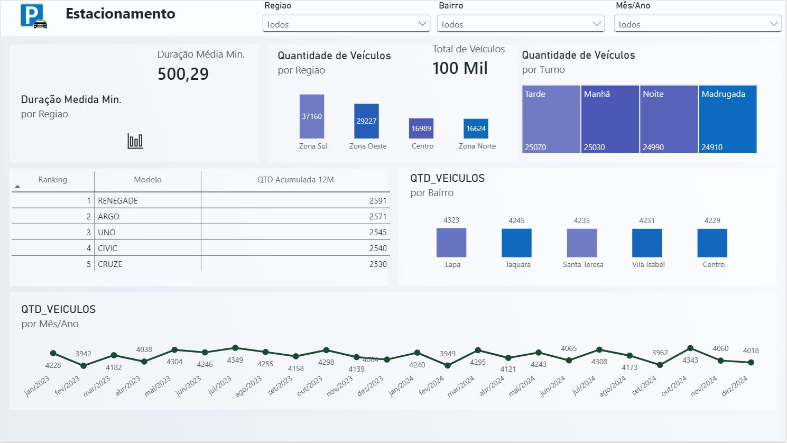
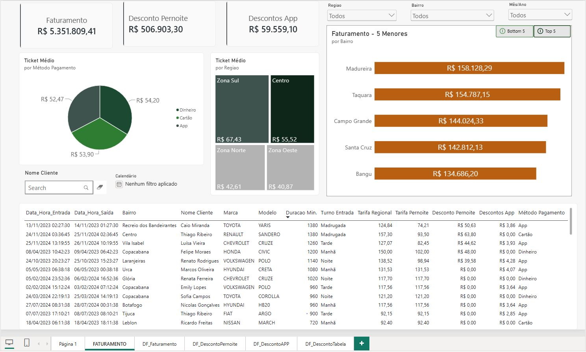

# 📊 Dashboard de Análise de Estacionamento | Power BI

## 🎓 Sobre o Projeto

Este dashboard foi desenvolvido em **Power BI** com o objetivo de aplicar conceitos de **Business Intelligence, Power Query, modelagem de dados, DAX e visualização de informações** em um cenário de gestão de estacionamento.

O projeto permite analisar o desempenho operacional e financeiro do estacionamento, acompanhando informações como **faturamento, descontos, ticket médio, duração das permanências, regiões, bairros, métodos de pagamento, clientes e características dos veículos**.

O dashboard foi estruturado em duas páginas principais, permitindo uma visão geral da operação e uma análise mais detalhada dos resultados financeiros.

## 🎯 Objetivo do Projeto

Desenvolver um dashboard interativo para acompanhar e analisar as operações de um estacionamento, permitindo identificar os principais indicadores financeiros e operacionais, analisar o comportamento dos clientes e veículos, comparar regiões e bairros e acompanhar o faturamento e os descontos aplicados.

O objetivo é transformar os dados do estacionamento em informações visuais que facilitem a análise dos resultados e auxiliem na tomada de decisões.

## 📌 Principais Informações Analisadas

🚗 **Operação do Estacionamento**

* Quantidade e movimentação de veículos
* Data e horário de entrada e saída
* Duração das permanências
* Turno de entrada dos veículos
* Distribuição das operações por região e bairro

💰 **Faturamento**

* Faturamento total
* Ticket médio
* Faturamento por bairro
* Ticket médio por região
* Ticket médio por método de pagamento

🏷️ **Descontos**

* Descontos de pernoite
* Descontos concedidos pelo aplicativo
* Análise dos valores de desconto aplicados

🚘 **Veículos**

* Marca dos veículos
* Modelo dos veículos
* Duração das permanências
* Relação entre veículo, período e faturamento

👤 **Clientes**

* Identificação dos clientes
* Análise das operações por cliente
* Consulta detalhada das movimentações

## Perguntas de Negócio 📌

💰 **Desempenho Financeiro**

* Qual é o faturamento total do estacionamento?
* Qual é o ticket médio das operações?
* Qual método de pagamento apresenta maior ticket médio?
* Quais regiões apresentam maior ticket médio?
* Quais bairros possuem maior faturamento?

📍 **Análise Geográfica**

* Quais regiões apresentam maior ticket médio?
* Quais bairros concentram maior faturamento?
* Quais são os 5 bairros com maior faturamento?
* Quais são os 5 bairros com menor faturamento?
* Como o desempenho varia entre as diferentes regiões?

🚗 **Análise Operacional**

* Qual é a duração média das permanências?
* Quais são os períodos/turnos com maior movimentação?
* Como as entradas e saídas de veículos estão distribuídas?
* Quais marcas e modelos de veículos aparecem com maior frequência?

🏷️ **Descontos**

* Qual é o valor total dos descontos de pernoite?
* Quanto é concedido em descontos pelo aplicativo?
* Qual é o impacto dos descontos no faturamento?
* Como os descontos estão distribuídos entre as operações?

💳 **Métodos de Pagamento**

* Qual método de pagamento apresenta maior ticket médio?
* Como o ticket médio varia entre Dinheiro, Cartão e App?
* Qual método de pagamento possui maior participação nas operações?

## 📄 Estrutura do Dashboard

### Página 1 — Visão Geral

A primeira página apresenta uma visão geral das operações do estacionamento, reunindo informações sobre **movimentação de veículos, duração das permanências, regiões, bairros, turnos e dados dos clientes e veículos**.

A página permite utilizar filtros e realizar análises mais específicas sobre o comportamento das operações.

### Página 2 — Faturamento

A segunda página possui foco na **análise financeira do estacionamento**, apresentando indicadores de faturamento, descontos e ticket médio.

Entre as principais análises estão:

* Faturamento total;
* Desconto de pernoite;
* Descontos realizados pelo aplicativo;
* Ticket médio por método de pagamento;
* Ticket médio por região;
* Ranking dos 5 bairros com maior faturamento;
* Ranking dos 5 bairros com menor faturamento;
* Detalhamento das operações realizadas.

## Processo 📍

* Importação e organização da base de dados
* Tratamento e padronização das informações
* Criação e organização das tabelas
* Modelagem dos dados
* Criação de relacionamentos
* Criação de medidas e cálculos utilizando **DAX**
* Desenvolvimento de KPIs financeiros e operacionais
* Criação de análises por região e bairro
* Criação de ranking de faturamento
* Desenvolvimento de filtros interativos
* Criação de análises de ticket médio
* Desenvolvimento de indicadores de descontos
* Construção de layout estratégico e visual profissional
* Criação de páginas auxiliares para detalhamento das informações

## 📸 Visualizações do Dashboard

### Página 1

### Página 2

## 📥 Downloads

[**⬇️ Baixar Dashboard de Estacionamento (.pbix)**](Estacionamento.pbix)

> **Observação:** para abrir o arquivo `.pbix`, é necessário ter o **Power BI Desktop** instalado.

## 🛠️ Tecnologias Utilizadas

* **Power BI**
* **DAX**
* **Power Query**
* **Excel**

## 💡 Insights do Projeto

* Identificação dos bairros com maior e menor faturamento
* Comparação do ticket médio entre diferentes regiões
* Análise dos métodos de pagamento utilizados
* Identificação dos principais valores de descontos de pernoite
* Análise dos descontos realizados pelo aplicativo
* Avaliação da duração das permanências dos veículos
* Análise da movimentação por região, bairro e turno
* Identificação das principais marcas e modelos de veículos
* Acompanhamento do faturamento total do estacionamento
* Análise detalhada das operações por cliente e veículo

## 📊 Conclusão

Este projeto demonstra a aplicação prática de conceitos de **Business Intelligence, Power Query, modelagem de dados, DAX e visualização de informações** para análise de um cenário de estacionamento.

O dashboard permite transformar dados operacionais e financeiros em informações relevantes para acompanhamento do negócio, possibilitando análises de **faturamento, ticket médio, descontos, regiões, bairros, veículos, clientes e movimentação**.

A utilização de indicadores, filtros interativos, rankings e visualizações facilita a identificação de padrões e oportunidades, contribuindo para uma **tomada de decisão baseada em dados**.
