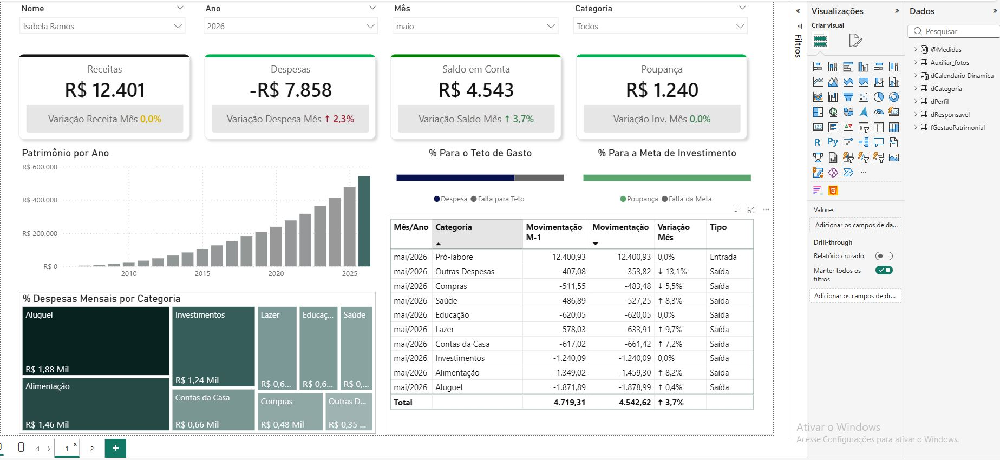
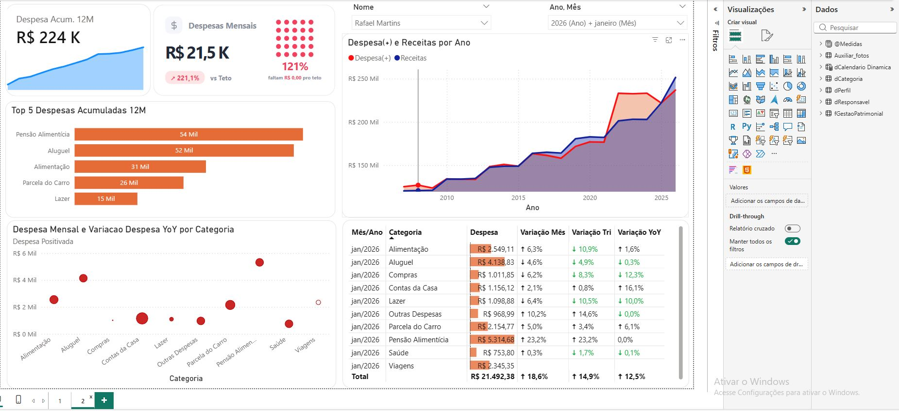

# 📊 Dashboard de Controle de Gastos Mensais | Power BI

## 🎓 Sobre o Projeto

Este dashboard foi desenvolvido **durante uma aula do curso de Power BI do Senac**, com o objetivo de aplicar na prática conceitos de **Business Intelligence, Power Query, modelagem de dados, DAX e visualização de informações**.

O projeto simula um cenário de controle financeiro, permitindo acompanhar os gastos mensais, identificar os principais responsáveis e categorias de despesas, analisar a evolução dos gastos ao longo do tempo e comparar o desempenho financeiro entre diferentes períodos.

## 🎯 Objetivo do Projeto

Desenvolver um dashboard interativo para acompanhar e analisar os gastos mensais, permitindo identificar os principais responsáveis e categorias de despesas, acompanhar a evolução dos gastos ao longo do tempo e comparar o desempenho financeiro entre diferentes períodos.

O objetivo é transformar os dados financeiros em informações visuais que facilitem o controle dos gastos e auxiliem na tomada de decisões.

## Perguntas de Negócio 📌

💰 **Controle Financeiro**

* Qual é o total de gastos no período?
* Qual é o total de receitas?
* Os gastos estão dentro do limite estabelecido?
* Quanto ainda está disponível para gastos?

📅 **Análise Temporal**

* Como os gastos evoluem ao longo dos meses?
* Quais meses apresentam maior volume de despesas?
* Existe variação significativa dos gastos entre os anos?
* Como os gastos atuais se comparam com períodos anteriores?

🏷️ **Categorias**

* Quais categorias possuem maior volume de gastos?
* Quais categorias representam maior impacto no orçamento?
* Existem categorias com aumento significativo de despesas?

👤 **Responsáveis**

* Qual responsável concentra maior volume de gastos?
* Como os gastos estão distribuídos entre os responsáveis?
* Existem diferenças relevantes no comportamento dos gastos?

📈 **Indicadores**

* Qual é o valor acumulado dos gastos nos últimos 12 meses?
* Qual foi a variação dos gastos em relação ao período anterior?
* Qual foi a variação anual (YoY)?
* Como está o desempenho em relação ao limite de gastos?

## Processo 📍

* Importação e organização da base de dados
* Tratamento e padronização das informações
* Modelagem dos dados
* Criação de relacionamentos
* Criação de medidas e cálculos utilizando **DAX**
* Desenvolvimento de KPIs financeiros
* Criação de análises temporais
* Desenvolvimento de ranking por categorias
* Desenvolvimento de filtros interativos
* Construção de layout estratégico e visual profissional

## 📸 Visualizações do Dashboard

### Página 1

### Página 2

## 📥 Download do Dashboard

[**⬇️ Baixar Dashboard de Controle de Gastos Mensais (.pbix)**](ControleGastosMensal.pbix)

> **Observação:** para abrir o arquivo `.pbix`, é necessário ter o **Power BI Desktop** instalado.

## 🛠️ Tecnologias Utilizadas

* **Power BI**
* **DAX**
* **Power Query**
* **Excel**

## 💡 Insights do Projeto

* Identificação das categorias com maior volume de gastos
* Análise da evolução das despesas ao longo dos meses
* Comparação dos gastos entre diferentes períodos
* Identificação dos responsáveis com maior participação nas despesas
* Análise da variação mensal e anual dos gastos
* Acompanhamento dos gastos acumulados nos últimos 12 meses
* Monitoramento do orçamento em relação ao limite de gastos

## 📊 Conclusão

Este projeto demonstra a aplicação prática de conceitos de **Business Intelligence, Power Query, modelagem de dados, DAX e visualização de informações**, desenvolvidos durante o **curso de Power BI do Senac**.

O dashboard permite uma visão geral dos gastos e possibilita análises mais detalhadas por período, categoria e responsável, contribuindo para um melhor acompanhamento financeiro e para uma tomada de decisão baseada em dados.
