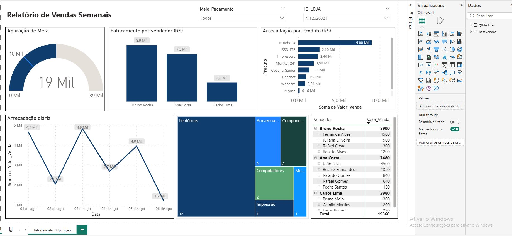

# 📊 Dashboard de Vendas Semanais | Power BI

---

## 📝 Sobre o Projeto

Dashboard desenvolvido durante o **curso de Power BI do Senac**, aplicando conceitos de Business Intelligence, Power Query, DAX e visualização de dados.

O projeto simula um cenário de vendas de uma rede de lojas, permitindo acompanhar o faturamento semanal, identificar os principais vendedores e produtos, e analisar a evolução das vendas ao longo do tempo.

---

## 📂 Bases de Dados

| Arquivo | Descrição |
|---------|-----------|
| [cadastro_lojas.xlsx](cadastro_lojas.xlsx) | Cadastro das lojas (ID, nome, localização, contato) |
| [planilha_vendas.xlsx](planilha_vendas.xlsx) | Registro de vendas (produtos, valores, vendedores, clientes, formas de pagamento) + Catálogo de produtos |

---

## 📥 Downloads

- [**⬇️ Baixar Dashboard (.pbix)**](Relatório_Vendas_V2.pbix)
- [**⬇️ Baixar Base de Dados de Vendas**](planilha_vendas.xlsx)
- [**⬇️ Baixar Base de Dados de Cadastro de Lojas**](cadastro_lojas.xlsx)

> Para abrir o arquivo `.pbix`, é necessário ter o **Power BI Desktop** instalado.

---

## 🛠️ Tecnologias

- Power BI
- DAX
- Power Query
- Excel

---

## 💡 Principais Análises

- ✅ Faturamento total e metas
- ✅ Ranking de vendedores
- ✅ Produtos mais vendidos
- ✅ Evolução diária das vendas
- ✅ Análise por categoria e forma de pagamento

---

## 📊 Conclusão

Este projeto demonstra a aplicação prática de conceitos de BI na criação de um dashboard funcional para análise de vendas, contribuindo para a tomada de decisão baseada em dados.
